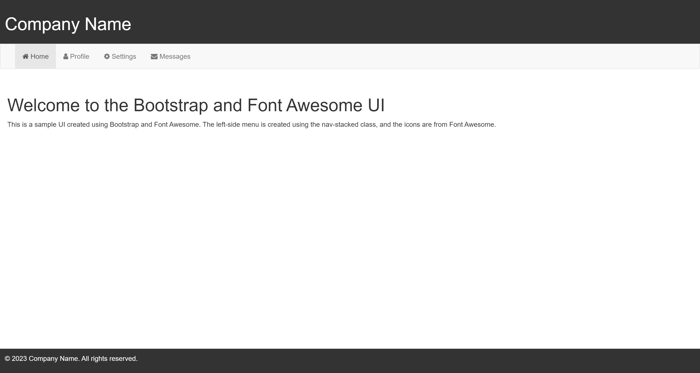

# Simple and Easy React and Font Awesome UI for Backend Design

This is a sample UI created using React and Font Awesome. The UI includes a navbar with a toggleable left-side menu that displays Font Awesome icons. The UI was created using the `reactstrap` library to create the navbar and menu, and the `@fortawesome/react-fontawesome` library to display Font Awesome icons.

## Installation

To install this UI on your local machine, follow these steps:

1. Clone the repository to your local machine using `git clone https://github.com/isrgrajan/Simple-Backend-Dashboard-in-React.git`
2. Navigate to the project directory using `cd Simple-Backend-Dashboard-in-React`
3. Install the required dependencies using `npm install`
4. Start the development server using `npm start`

## Usage

Once the development server is running, open your web browser and navigate to `http://localhost:3000` to view the UI. 

The left-side menu can be toggled open and closed using the button in the navbar.

## Credits

This UI was created by Isrg Rajan.

The following libraries were used in the creation of this UI:

- React
- Reactstrap
- Font Awesome

## License

This project is licensed under the MIT license. See the `LICENSE` file for more details.
